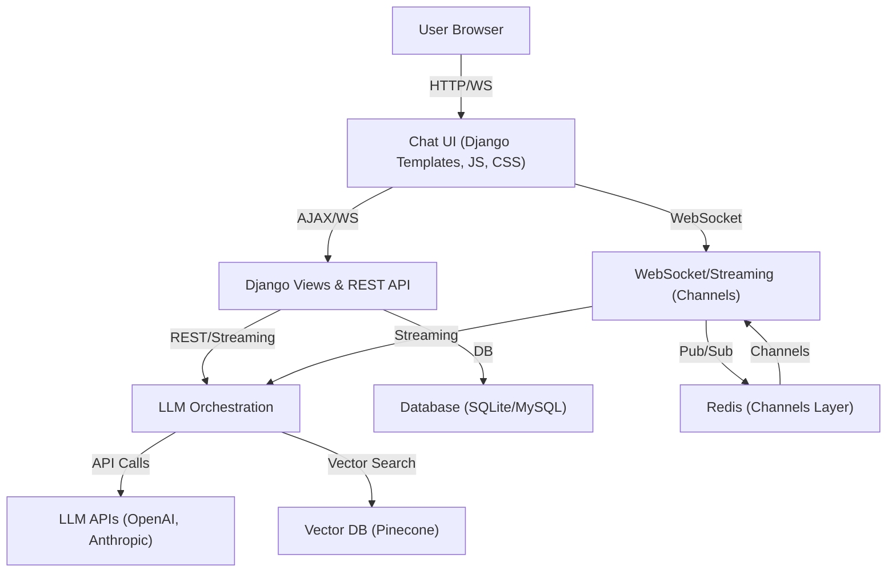

# Blockchain LLM Chat Assistant (Expert Edition)

> The source code will be live soon. Meanwhile, you can try the live application at [https://coderun.ai/](https://coderun.ai/)

## Executive Summary
This project is a production-grade, modular, and extensible full-stack system for real-time, streaming, ChatGPT-like interaction focused exclusively on blockchain and Web3 domains. It is designed for data scientists, ML engineers, and blockchain developers who require:
- **Low-latency, high-accuracy LLM responses**
- **Advanced prompt engineering and context management**
- **Seamless integration with OpenAI, Anthropic Claude, and vector DBs (Pinecone)**
- **Scalable, real-time chat via Django Channels and Redis**
- **A robust, extensible backend for research or production**

## Key Features
- **Streaming LLM Chat**: Token-level streaming via WebSockets and HTTP, with zero perceptible delay.
- **Blockchain-Only Expert**: All responses are contextually filtered and engineered for blockchain, smart contracts, and the XinFin XDC Network.
- **Prompt Engineering**: Modular, expert-level prompt templates and context assembly for maximum LLM relevance and safety.
- **Vector Search**: Pinecone-powered semantic retrieval for grounding LLM responses in curated blockchain knowledge.
- **Multi-LLM Support**: Easily switch or extend to new LLM providers (OpenAI, Anthropic, etc.).
- **WebSocket/REST API**: Real-time and batch endpoints for integration with external systems.
- **User & Chat Analytics**: Persistent storage of all interactions for research, analytics, and compliance.
- **Production-Ready Stack**: Django, Channels, Redis, Pinecone, and robust environment management.

## System Architecture



## Extensibility & Research Use
- **LLM Agnostic**: Add new LLMs by implementing a single interface in the orchestration layer.
- **Prompt Engineering**: All prompts are modular and versioned for A/B testing and research.
- **Vector DB**: Swap Pinecone for any vector DB with minimal code changes.
- **Blockchain Domain Adaptation**: To support new chains, update the context ingestion and prompt templates.
- **Analytics**: All chat data is stored for downstream ML, compliance, or user research.

## Environment & Deployment
### Prerequisites
- Python 3.8+
- Redis (for Channels pub/sub)
- Pinecone account (or compatible vector DB)
- OpenAI/Anthropic API keys

### Setup
```bash
python3.8 -m venv venv
source venv/bin/activate
pip install --upgrade pip
pip install -r requirements.txt
```

Create a `.env` file in the project root:
```
OPENAI_API_KEY=your-openai-key
CHUNK_SIZE=1000
PINECONE_API_KEY=your-pinecone-key
PINECONE_ENV=your-pinecone-env
PINECONE_INDEX_NAME=your-index-name
# Add any other required variables
```

Run migrations and start services:
```bash
python manage.py migrate
redis-server &
python manage.py runserver
# or for full WebSocket support:
daphne -p 8000 myProject.asgi:application
```

## Usage
- Access the chat UI at `http://localhost:8000/`
- Ask blockchain-related questions; receive streaming, context-grounded answers.
- All interactions are logged for research and analytics.

## Extending the System
- **Add a new LLM**: Implement a new client in the orchestration layer and update the model selection logic.
- **Support new blockchain domains**: Ingest new context into Pinecone and update prompt templates.
- **Integrate with external systems**: Use the REST/WebSocket APIs for automation or third-party integration.

## Research & Production Notes
- **Prompt Engineering**: All prompts are versioned and can be A/B tested for optimal LLM performance.
- **Streaming**: Designed for minimal latency; suitable for both research and production.
- **Security**: All API keys and secrets are managed via environment variables.
- **Compliance**: Persistent chat logs enable audit and compliance workflows.

## Open Source & Contribution
- The source code will be open-sourced soon. Please star and watch this repository for updates.
- Contributions, issues, and feature requests are welcome after the public release.

## Contact
For research collaboration or enterprise inquiries, please open an issue or contact the maintainer after the code is open-sourced.

## Signature & Contact

---

**Developed by Ajay Jatav**  
For any query or collaboration, please contact: [queryajayjatav@gmail.com](mailto:queryajayjatav@gmail.com)

- **Live Application:** [https://coderun.ai/](https://coderun.ai/)
- **LinkedIn:** [Ajay Jatav](https://www.linkedin.com/public-profile/settings?trk=d_flagship3_profile_self_view_public_profile)
- **Upwork:** [Ajay Jatav on Upwork](https://www.upwork.com/freelancers/~019035a60af2847578?viewMode=1)
=======
# blockchain-llm-chat-assistant
>>>>>>> 0c61f053256e4a9601daf5dc612154daf2f7ab91
